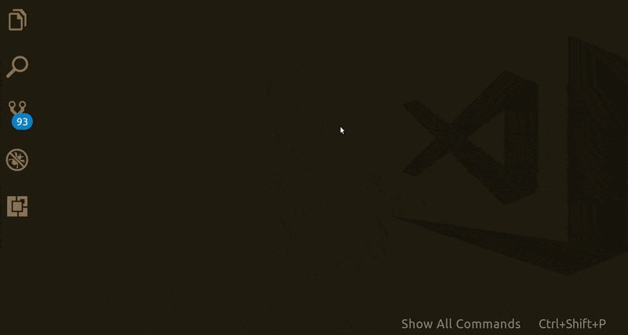
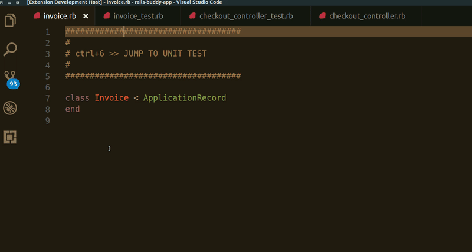
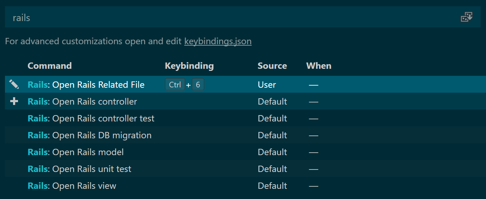

# rails-buddy README

`rails-buddy` was inpired by the [rails.vim](https://github.com/tpope/vim-rails). It activates whenever a rails project is detected in the current workspace.

## Features

This extension provides shortcuts for easy navigation across rails projects files. The following commands make easy to find and open files by role:

* `Open Rails Model`
* `Open Rails Controller`
* `Open Rails Unit Test`
* `Open Rails Controller Test`
* `Open Rails View`
* `Open Rails Migration`

It is also possible to use the `Open Rails Related File` to jump directly from:
* `Model` <--> `Unit Test`
* `Controller` <--> `Controller Test`

## Requirements

* VSCode 1.19 and above

## Extension Settings
All commands can be assigned to shortcut keys. The `Open Rails Related File` command is assigned to `Ctrl + 6` by default. 

## Known Issues
--

## Release Notes

### 1.0.0

Initial release:

1. Support for the most common Rails files: 
   * Models
   * Controllers
   * Unit (Model) tests
   * Functional (Controller) tests
   * Views
   * Migrations

2. Jump between related files

-----------------------------------------------------------------------------------------------------------